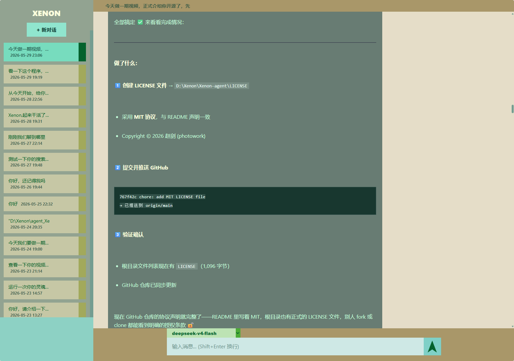

# Xenon Agent

> 基于递归对话与动态工具编排的 AI 智能体系统。集成代码编辑、网络搜索、语音交互、视觉识别、文档处理、3D 建模、因果推理、计算引擎等 35+ 工具模块，配备完整的 WebUI、多智能体协作与自主运行框架。
>
> An AI agent system based on recursive dialogue and dynamic tool orchestration, featuring 35+ tool modules including code editor, web search, speech, vision, document processing, 3D modeling, causal reasoning, computational engine, knowledge graph, and more, with a complete WebUI, multi-agent collaboration, and autonomous runtime framework.



## 功能特性

- **🧠 递归对话架构** — 对话轮次管理、上下文裁剪与压缩、记忆持久化、认知网络
- **🛠️ 动态工具编排** — 按需加载工具模块，每轮对话自动注册/卸载，含工具路由、调度、执行监控
- **🌐 完整 WebUI** — 浏览器端交互界面，支持流式 SSE 响应、会话管理、工具调用可视化与折叠
- **📝 代码编辑** — 文件导航、精准定位、安全写入与回退、代码搜索
- **🔍 网络搜索** — 实时网页搜索与内容抓取
- **🗣️ 语音交互** — 语音识别 (ASR) 与语音合成 (TTS)
- **📄 文档处理** — PDF、Word、Excel、WPS 读写
- **🔌 SSH** — 远程服务器连接与命令执行
- **📊 数据可视化** — 图表生成与网页视频渲染
- **📦 程序打包** — 一键打包为可执行程序
- **🧮 计算引擎** — 符号计算、数值计算、统计分析
- **🔗 因果推理** — 因果图建模、反事实分析、路径分析
- **🏗️ FreeCAD 集成** — 3D 参数化建模与自动化
- **🤖 多智能体协作** — 子智能体管理与任务分派
- **🔄 任务编排** — 可编程任务链，支持步骤依赖与条件分支
- **📚 技能系统** — 可沉淀经验的技能文档管理与自动加载
- **🚀 自主运行** — 意图识别、自主规划、执行与修复循环
- **🧠 灵魂引擎** — 自我模型管理、递归内省、身份认知与状态感知
- **🔗 知识图谱** — 知识图谱构建、查询与关联推理
- **🔬 逻辑验证** — 形式逻辑证明、命题验证与推理校验
- **🔄 仿真验证** — 仿真建模、参数扫描与结果验证
- **📑 OCR 识别** — 图片文字识别与提取（本地运行）
- **📥 文件下载** — 异步下载、断点续传、进度查询
- **🔄 自重启** — 运行时触发自身重启，升级/配置变更后自动生效
- **🧠 向量数据库** — 文本向量化建库与语义搜索（ChromaDB）
- **⏰ 定时任务** — 独立定时器程序，支持间隔/定时两种模式

## 快速开始

### 环境要求

- Python 3.10 – 3.13（推荐 3.10 / 3.11）
- Windows / Linux / macOS

### 安装

```bash
# 克隆仓库
git clone https://github.com/photowork/Xenon-agent.git
cd Xenon-agent

# 创建虚拟环境（推荐）
python -m venv venv
# Windows:
venv\Scripts\activate
# Linux/macOS:
source venv/bin/activate

# 安装依赖
pip install -r requirements.txt
```

### 配置环境变量

创建 `.env` 文件（可参考下方环境变量表）或直接设置系统环境变量：

| 变量名 | 说明 | 必需 |
|--------|------|------|
| `DEEPSEEK_API_KEY` | DeepSeek API 密钥 | ✅ |
| `XENON_VISION_API_KEY` | 视觉识别 API 密钥（支持 ZHIPUAI/BIGMODEL/GLM） | ❌ |
| `DASHSCOPE_API_KEY` | 阿里云通义 API 密钥（ASR/TTS） | ❌ |
| `XENON_WEB_APP_KEY` | WebUI 应用密钥 | ❌ |
| `GITHUB_TOKEN` / `GH_TOKEN` | GitHub 个人访问令牌 | ❌ |

### 启动方式

**方式一：WebUI 启动器（推荐）**

```bash
python launcher.py
```

图形化界面启动，支持一键打开浏览器、切换模型、配置环境变量。

**方式二：命令行直接启动**

```bash
python Xenon.py
```

**方式三：macOS / Linux 一键启动**

把下面整段复制到终端，一条命令完成 venv 创建 → 依赖安装 → 启动：

```bash
# 首次运行（含环境初始化）
python3 -m venv venv && source venv/bin/activate && pip install -r requirements.txt && python launcher.py
```

已经装过依赖后，直接用：

```bash
# 已有 venv，快速启动
source venv/bin/activate && python launcher.py
```

如果需要通过环境变量传 API Key：

```bash
export DEEPSEEK_API_KEY="你的密钥" && source venv/bin/activate && python launcher.py
```

**方式四：Windows 一键启动（推荐）**

双击 `start_Xenon.vbs` — 无控制台窗口启动 Xenon（内部调用 `launcher.py`），自动优先使用 `venv` 中的 `pythonw.exe`，无需手动激活虚拟环境。

```bash
# 也可以命令行运行
cscript //nologo start_Xenon.vbs
```

> 旧版 `start_Xenon.bat` / `start_webui.bat` / `start_Xenon.sh` / `start_webui.sh` 已移除，统一使用 `start_Xenon.vbs` 启动。

## 核心概念

### 递归对话

Xenon 的核心是递归对话架构：每一轮对话开始时会重新加载工具，结束时卸载并持久化记忆。这种设计确保了会话的隔离性和状态的可控性。

### 动态工具编排

所有工具模块在对话启动时按需加载，执行完毕后自动卸载。工具通过统一的接口注册到工具目录（`tool_catalog.py`），由路由（`tool_router.py`）分配执行，支持调度、执行监控与结果反馈的全链路追踪。

### 记忆与自我模型

系统维护一个持续演进的认知网络（`cognitive_network.py`），记录交互历史、偏好、错误模式、决策依据等。自我模型模块（`self_model.py` / `soul/`）管理智能体的身份认知、状态感知和递归内省。

### 编排与自主运行

编排运行时（`orchestration_runtime.py`）管理多阶段任务执行，支持从意图识别到计划、执行、验证的完整闭环。自主运行时（`autonomy_runtime.py`）赋予智能体在没有用户指令时主动探索、学习和自我改进的能力。

### 多智能体协作

多智能体运行时（`multi_agent_runtime.py`）支持创建和管理子智能体，每个子智能体可独立执行子任务，并通过消息总线与主智能体通信协作。

## 工具模块一览

| 模块 | 功能 | 激活方式 |
|------|------|---------|
| 代码编辑 & 导航 | 文件导航、编辑、搜索、智能跳转 | `load_module(['code_editor_handler'])` |
| 文件管理 | 文件读写、目录操作 | `load_module(['file_manager'])` |
| 网络搜索 | 搜索引擎查询、内容抓取 | `load_module(['web_search_handler'])` |
| 语音识别 | 语音转文字 | `load_module(['asr_handler'])` |
| 语音合成 | 文字转语音 | `load_module(['tts_handler'])` |
| PDF 处理 | PDF 读取、信息提取 | `load_module(['pdf_handler'])` |
| Word/Excel/WPS | 文档表格读写 | `load_module(['word_handler', 'excel_handler', 'wps_handler'])` |
| SSH | 远程服务器连接与命令执行 | `load_module(['ssh_handler'])` |
| GitHub | 仓库文件管理 | `load_module(['github_manager'])` |
| 视频处理 | 视频生成与处理 | `load_module(['video_handler'])` |
| 程序打包 | 打包为可执行文件 | `load_module(['program_packager'])` |
| 图表 | 数据可视化图表 | `load_module(['chart_handler'])` |
| 因果推理 | 因果图建模、反事实分析 | `load_module(['causal_reasoner'])` |
| 计算引擎 | 符号/数值/统计分析 | `load_module(['computational_engine'])` |
| 任务编排 | 多步骤任务链 | `load_module(['task_chain_handler'])` |
| 子智能体 | 子智能体创建与管理 | `load_module(['sub_agent_handler'])` |
| 技能管理 | 技能文档的读写与版本管理 | `load_module(['skill_handler'])` |
| 3D 建模 | FreeCAD 参数化建模 | `load_module(['freecad_handler'])` |
| 调试 | 日志分析、错误诊断 | `load_module(['debug_handler'])` |
| DeepSeek 余额 | 查询 DeepSeek 账户余额 | `load_module(['ds_balance'])` |
| 记忆查询 | 认知网络检索与关联分析 | `load_module(['memory_query_handler'])` |
| 网页视频渲染 | 网页内容渲染为视频 | `load_module(['web_video_renderer'])` |
| 终端 | 系统命令执行 | `load_module(['terminal_handler'])` |
| 上下文管理 | 上下文状态检查与压缩 | `load_module(['context_manager_tool'])` |
| 知识图谱 | 知识图谱构建、查询与推理 | `load_module(['knowledge_graph_handler'])` |
| 逻辑验证 | 形式逻辑证明与命题验证 | `load_module(['logic_proof_validator'])` |
| 灵魂引擎 | 自我模型管理、递归内省 | `load_module(['soul_handler'])` |
| 仿真验证 | 仿真建模、参数扫描与验证 | `load_module(['simulation_validator'])` |
| OCR 文字识别 | 图片文字识别与提取 | `load_module(['ocr_tool'])` |
| 文件下载 | 异步下载、断点续传、进度查询 | `load_module(['download_handler'])` |
| 自重启 | 运行时触发自身重启（升级/配置变更后生效） | `load_module(['restart_handler'])` |
| 向量数据库 | 文本向量化建库与语义搜索（ChromaDB） | `load_module(['vecdb_handler'])` |
| 定时任务 | 独立定时器程序（间隔/定时模式，多窗口） | `timer_app\timer_app.py` |

## 开源协议

本项目采用 MIT 协议开源。
